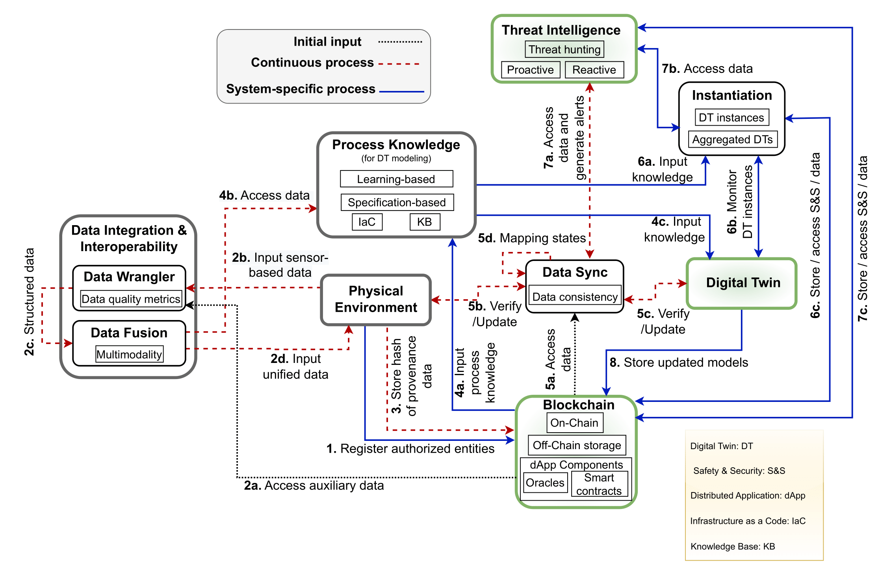
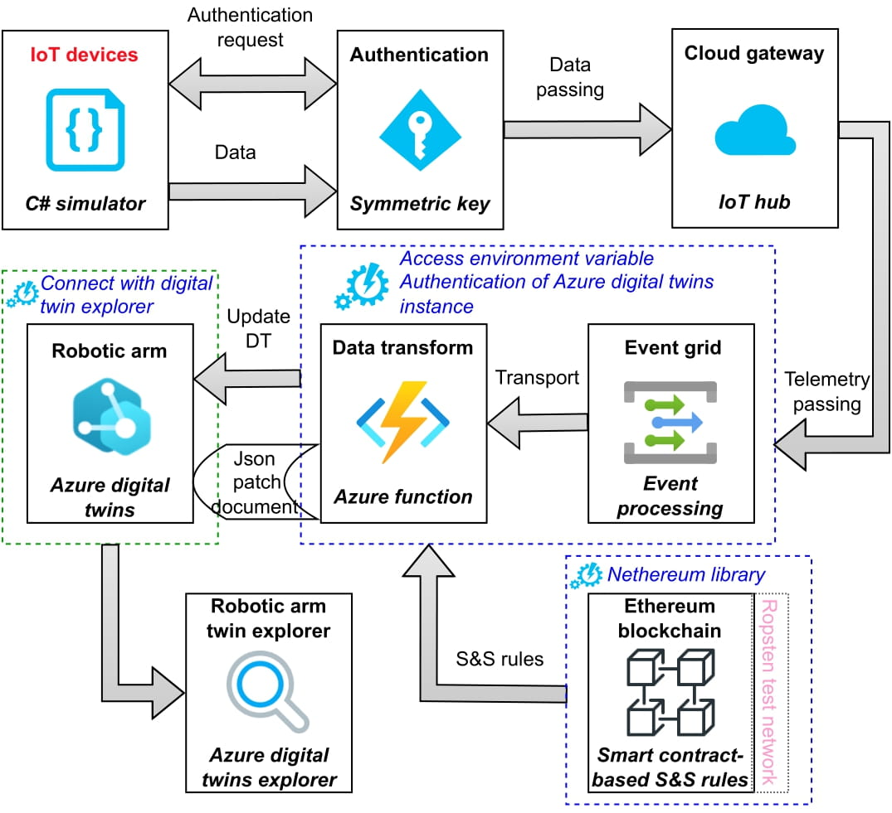

# TRIPLE: A Blockchain-based Digital Twin Framework for Cyber-Physical Systems Security
TRIPLE framework that leverages and integrates provenance-enabled blockchain solution with simulation mode of digital twins to ensure reliability and traceability of data during data acquisition and dissemination at both physical and virtual environments.



We present a prototypical implementation
of the TRIPLE framework and generate a virtual environment to demonstrate how physical assets, i.e., robotic arm and temperature sensor can be modeled and analyzed through the twinned environment. We use the Microsoft Azure Digital Twins service that models digital twins in a cloud computing environment following Platform-as-a-Service architecture and enables physical twin monitoring in a virtual environment. 



# Models
Azure Digital Twins provide ability to define vocabulary for building twin graph. This capability is provided through user-provided [models](https://learn.microsoft.com/en-us/azure/digital-twins/concepts-models). Azure Digital Twins models are represented in the JSON-LD-based [Digital Twin Definition Language (DTDL)](https://marketplace.visualstudio.com/items?itemName=vsciot-vscode.vscode-dtdl). We created two models, one related to robotic arm interface (RoboticArmInterface.json), another defines the temperature sensor (TemperatureSensor.json).


# Simulators
We use a simulator approach to generate and simulate data from two temperature sensors without having the need to configure and manage physical IoT devices. The simulator includes the temperature sensor configurations, robotic arm telemetry, and provides the authentication settings to connect with Azure IoT Hub.

We created two simulators for two robotic arms to simultanesouly generate temperature data from both robotic arms. Navigate to **simulators/RoboticArm_01** and **simulators/RoboticArm_02** directories in two different terminals and execute ```dotnet run``` commad to start simulators. The simulators will generate data for two temperator sensors is json format and send it to the ingestor.
```json
{
    "id":"RA01_Temperature_Sensor_01",
    "temperature":25.24989852320864
}
```
```json
{
    "id":"RA02_Temperature_Sensor_01",
    "temperature":55.54934268234109
}
```

# Ingestor
The Azure function is used to create the process of ingesting data into the Azure Digital Twins. The function receives the data and uses a JSON document patch to transform it, then updates the digital twins properties using the digital twins APIs.

Use Microsoft Visual Studio to compile and deploy ingestor to Microsoft Azure cloud using Azure function.

# Solidity Smart Contract
We create a decentralized application (dApp) on the Ethereum blockchain that assists us in establishing and obtaining safety and security rules (e.g., temperature threshold). We deploy the dApp on the Ethereum Ropsten test network and using the [Nethereum library](http://docs.nethereum.com/en/latest/), we make interactions with the dApp and Ethereum nodes.

Smart contract application binary interface (ABI) and connection details are available in: ```ingestor\DataIngestor\IoTHubToAzureDataTwinsFunction.cs```

# Azure digital twin explorer
Azure Digital Twins explorer is a visual tool for exploring the data in Azure Digital Twins graph. As well as, to view, query, and edit models, twins, and relationships. 

[Azure Digital Twins Explorer](https://learn.microsoft.com/en-us/azure/digital-twins/concepts-azure-digital-twins-explorer)

[Setup Azure Digital Twins Explorer Locally](https://learn.microsoft.com/en-us/samples/azure-samples/digital-twins-explorer/digital-twins-explorer)

